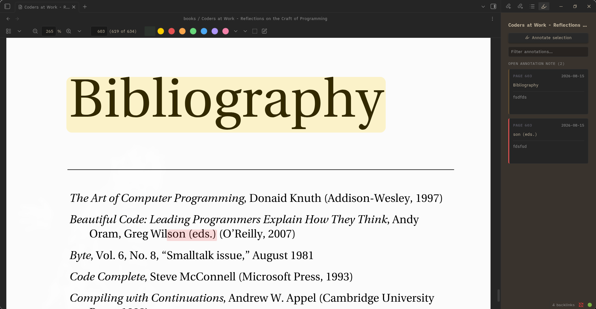

# Scholar PDF

Read and annotate PDFs inside [Obsidian](https://obsidian.md) without friction. Select text, click a color, done — your highlights are painted onto the PDF and saved as plain markdown notes in your vault.

Scholar PDF is a fork of the excellent [PDF++](https://github.com/RyotaUshio/obsidian-pdf-plus) that adds an [Annotator](https://github.com/elias-sundqvist/obsidian-annotator)-style annotation experience on top: a floating selection popup, an annotation card sidebar, and one markdown annotation file per PDF. It works on any PDF — books, papers, manuals — with zero setup.



## Features

### One-click highlighting
Select text in a PDF and a small popup appears right at your selection:

- **Color dots** (red, orange, green, blue, purple, pink) — instantly highlight the selection in that color. Nothing else happens; no clipboard, no dialogs.
- **Comment button** — opens a small input to attach a note. Comment annotations are always yellow, so you can tell "thoughts" apart from plain highlights at a glance.

The same actions are available from the right-click menu ("Annotate selection", "Highlight \<color\>") and as commands you can bind to hotkeys.

### Annotation sidebar
A native sidebar (ribbon highlighter icon, or the "Open annotations sidebar" command) lists all annotations for the active PDF as cards: page number, highlighted text, and your comment. Cards are accented with the highlight's color.

- Click a card (or its quote) to jump to that spot in the PDF.
- Click a highlight in the PDF to reveal and flash its card in the sidebar.
- Edit or delete annotations from the card's hover actions.

### Plain-markdown storage
Each PDF gets one annotation file: `annotations/<pdf name>.md` (folder configurable via `scholarAnnotationFolder`). Annotations are ordinary markdown blockquote callouts with block IDs and standard Obsidian links back into the PDF, so they work with search, graph view, backlinks, and sync — and remain readable even without this plugin. Your PDFs are never modified.

### Reading niceties
- The PDF sidebar defaults to the (nested) table of contents; the thumbnails view is removed from the menu.
- Everything follows your Obsidian theme, light or dark.

### Everything from PDF++
Scholar PDF is a superset of PDF++, so all of its features are still here: backlink highlighting, copy links to selections with templates, PDF editing tools, and much more. See the [PDF++ documentation](https://ryotaushio.github.io/obsidian-pdf-plus/) for the full reference.

## Installation

### With BRAT (recommended)
1. Install the [BRAT](https://obsidian.md/plugins?id=obsidian42-brat) community plugin.
2. In BRAT settings, choose **Add beta plugin** and enter:
   ```
   prdai-archive/obsidian-scholar-pdf
   ```
3. Enable **Scholar PDF** in *Settings → Community plugins*.

BRAT will keep the plugin updated as new releases are published.

### Manual
Download `main.js`, `manifest.json`, and `styles.css` from the [latest release](https://github.com/prdai-archive/obsidian-scholar-pdf/releases/latest) into `<your vault>/.obsidian/plugins/scholar-pdf/`, then enable the plugin.

> **Note:** Disable PDF++ and Annotator if you have them installed — Scholar PDF replaces both, and running them side by side will conflict.

## Usage

1. Open any PDF in Obsidian.
2. Select some text.
3. Pick a color from the popup to highlight, or hit the comment button to annotate (Ctrl/Cmd+Enter submits).
4. Open the annotation sidebar (highlighter ribbon icon) to browse, jump, edit, or delete.

The annotation file is created automatically on your first highlight. Open it like any note — every entry links back to the exact selection in the PDF.

## Settings

Scholar-specific options (in the plugin's `data.json`; settings UI coming):

| Key | Default | Meaning |
| --- | --- | --- |
| `scholarAnnotationFolder` | `annotations` | Vault folder for per-PDF annotation files |
| `scholarAskForComment` | `true` | "Annotate selection" prompts for a comment |
| `scholarOpenSidebarOnAnnotate` | `true` | Open the sidebar after saving an annotation |

Highlight colors are configured in *Settings → Scholar PDF → Colors* (the standard PDF++ color settings). The color named `Yellow` is reserved for comment annotations.

## Building from source

```bash
pnpm install
pnpm run build   # typecheck + bundle to main.js
pnpm run dev     # watch mode
```

## Credits & license

- [PDF++](https://github.com/RyotaUshio/obsidian-pdf-plus) by Ryota Ushio — the foundation this fork is built on.
- [Annotator](https://github.com/elias-sundqvist/obsidian-annotator) by Elias Sundqvist — inspiration for the annotation UX and per-file storage.
- [Obsidian Scholar](https://github.com/lolipopshock/obsidian-scholar) by Shannon Shen — inspiration for the library structure.

MIT — see [LICENSE](LICENSE) and [THIRD_PARTY_LICENSES](THIRD_PARTY_LICENSES).
